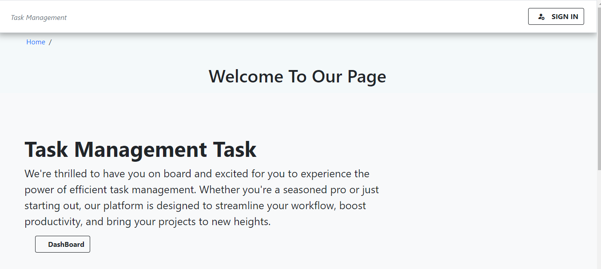
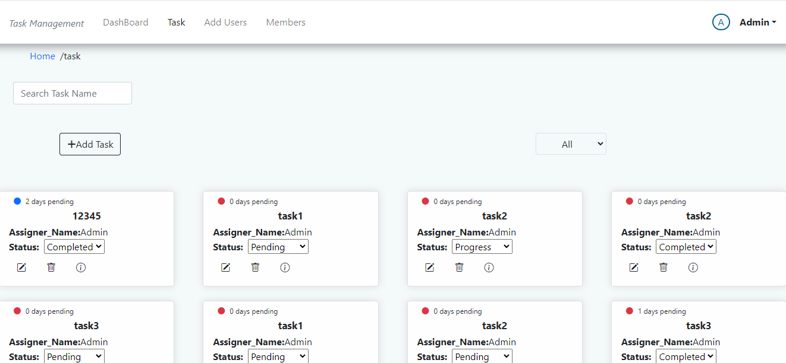

# Task Management Task

### Task DashBoard

### Task 

## Tools and Technologies

- HTML
- CSS
- Javascript
- Bootstrap
- React
- Node.js
- Express.js
- Mongodb

## Dependencies

Following are the major dependencies of the project:

- axios
- bootstrap
- bootstrap-icons
- encrypt-storage
- formik
- react
- react-dom
- react-redux
- @reduxjs/toolkit
- react-router-dom
- react-slick
- yup
- bcryptjs
- body-parser
- cors
- dotenv
- express
- jsonwebtoken
- mongoose
- nodemon

## Prerequisites

- Node.js must be installed on the system.
- You should have a MongoDB database.
- You should have a code editor (preferred: VS Code)

## Contact

- Email: prakasht1405@gmail.com